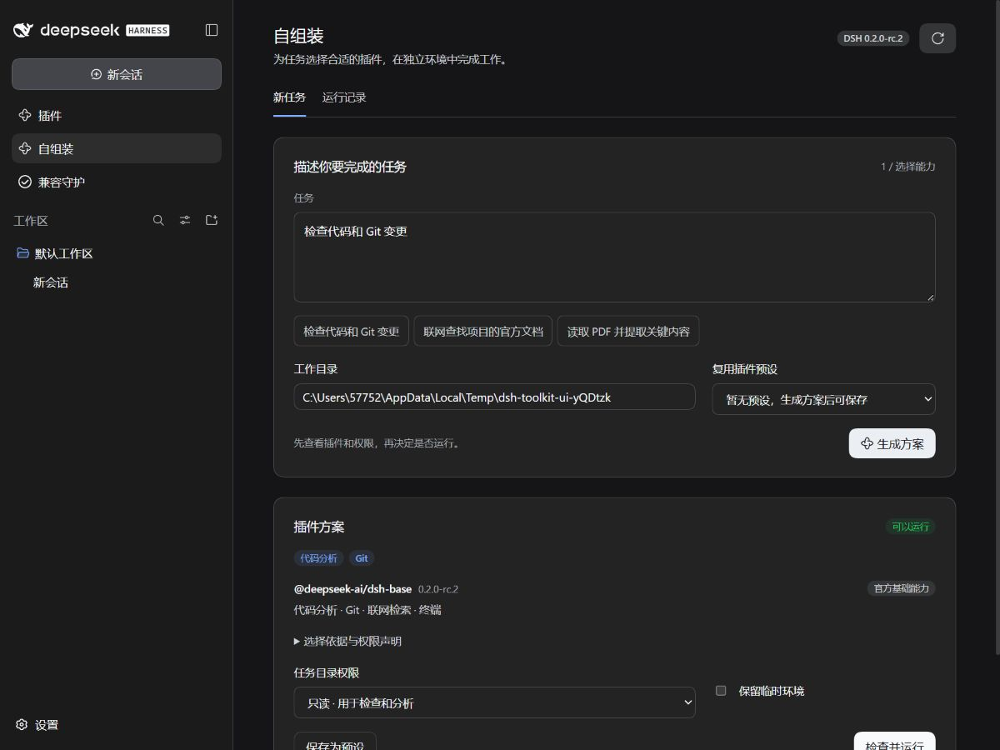

# dsh-autocompose

**Task-aware plugin composition for DeepSeek Harness.**

根据任务选择插件，展示兼容性与权限，再在独立运行环境中执行。当前实现对应 DSH `0.2.0-rc.2`，Node.js `>=22.19`。

## 安装

在 DSH 插件管理页的安装框中输入以下包名：

```text
dsh-autocompose@0.2.1
```

Desktop 命令行安装：

```powershell
dsh plugin --profile desktop add dsh-autocompose@0.2.1 --save-exact --ignore-scripts
```

Web 用户将 `desktop` 改成 `web`。也可在安装框中粘贴仓库地址 `https://github.com/Han-1413141/dsh-autocompose`；从 0.2.1 起，仓库已包含编译后的 `lib/`，安装时无需构建，也无需添加 `allowBuilds`。

如果仍出现 `ERR_PNPM_GIT_DEP_PREPARE_NOT_ALLOWED`，检查安装目标是否固定到了 0.2.0 的旧提交；改用上面的 npm 包名，或重新粘贴仓库地址。`Failed to replace env in config: ${NPM_TOKEN}` 是 npm 配置变量提示，与 Git 构建被拦截是两个问题；安装这两个公开包不需要 npm Token。

安装后打开侧边栏“自组装”。独立 CLI 可通过 `npx --yes --package=dsh-autocompose@0.2.1 dsh-autocompose --help` 查看用法。SDK 客户端已编译在插件中；任务执行复用现有 DSH `0.2.0-rc.2`，仍使用独立配置目录，并需要 pnpm 和模型凭据。安装插件不再下载另一套 DSH。规划不调用模型。

[源码](https://github.com/Han-1413141/dsh-autocompose) · [问题反馈](https://github.com/Han-1413141/dsh-autocompose/issues) · [故障覆盖表](https://github.com/Han-1413141/dsh-autocompose/blob/master/docs/failure-matrix.md)

## Web 页面

安装到 Web profile 后，点击侧边栏“自组装”。输入任务与工作目录，生成组合，再查看能力覆盖、插件版本、兼容性提示和权限。缺少能力时会说明缺项，并阻止运行。

页面提供只读与工作区修改两种模式；点击运行后，再在原生弹窗中确认。任务由宿主后台执行，切换页面不会中止，可以主动取消。进度显示准备、安装、检查、执行和清理阶段，结束后保留结果与清理状态。

预设、最近计划和运行历史保存在同一状态目录中。复用预设会重新计算兼容性；换任务时也重新识别所需能力。异常退出后未完成的记录显示“已中断”；其他进程仍在运行的任务保持运行状态。历史记录会跳过无法读取的文件并显示提示。

界面跟随 DSH 明暗主题，使用原生按钮、输入框和确认弹窗。规划不会调用模型；执行使用下方配置的模型和凭据。

## 工作流程

1. 从中文或英文任务识别 `pdf / web / code / git / browser / vision / memory / shell`，也支持显式指定能力。
2. 复用官方 SDK 基础环境。缺少 PDF、浏览器、视觉或记忆能力时，搜索 npm，检查最多 5 个候选的 bundle 元数据和版本要求；一次最多搜索 4 种能力。
3. 优先选择覆盖所需能力、依赖满足、权限声明较少的组合，拒绝已知冲突与旧版核心组件依赖。搜索说明推断出的能力会明确标注，不能当成功能验证。
4. 保存包含任务、目录、包版本、制品完整性值、权限和指纹的计划。缺少能力时禁止执行。
5. 用户批准后创建独立 `DSH_HOME`，通过官方 CLI 安装精确版本的插件，禁止依赖生命周期脚本；核验实际安装内容并通过官方 SDK 执行。
6. 返回最终回复、会话标识及事件数量，关闭子进程，删除本次临时目录，保留运行记录。`--keep` 可以保留环境用于排障。

## 命令行

以下命令在代码仓库根目录执行，先完成根目录的 `npm install --ignore-scripts` 和 `npm run build`。

```powershell
# 只生成计划；缺少能力时查询公共 npm 元数据。
node lib/cli.js plan --task "提取 PDF 内容并检查代码仓库"

# 仅用内置能力规划，不补充搜索；能力不足会列入 missing。
node lib/cli.js plan --task "检查代码仓库" --no-discovery

# 查看计划后，替换计划 ID 再执行。此步需要模型凭据。
node lib/cli.js run --id <planId> --yes

# 明确允许任务工具修改工作目录。
node lib/cli.js run --id <planId> --mode workspace-write --yes

# 保存并复用插件组合。
node lib/cli.js save-preset --id <planId> --preset code-review
node lib/cli.js use-preset --preset code-review --task "检查另一个代码问题" --yes

# 单独搜索候选；不安装、不调用模型。
node lib/cli.js discover --capability pdf
```

CLI 默认状态目录为当前目录下的 `.dsh-autocompose`；可用 `--root` 指定。`--cwd` 指定任务目录。所有操作都应保持同一状态目录。默认 provider 为 `deepseek-official`，模型为 `deepseek-v4-flash`，默认仅向子进程转发 `DEEPSEEK_API_KEY`，不复制原 DSH 凭据文件。自定义 provider 需要相应的子环境配置，单改模型名称不会自动复制宿主 provider。

DSH 页面与工具自动使用宿主安装目录。通过 `npx` 单独执行任务时，使用 `--install-anchor <现有DSH安装中的package.json>` 指定运行时；缺少运行时或版本不匹配会给出错误，不会自动安装整套宿主。查看帮助、规划和发现插件无需该参数。

`--timeout` 默认为 600000 毫秒。取消操作会关闭所拥有的 SDK 子进程；关闭无法确认时保留临时目录并报告错误。独立配置目录不是安全沙箱。

## DSH 工具与配置

工具名为 `autocompose`，支持 `plan`、`run`、`save_preset`、`discover`。执行计划限定在创建它的会话中。实际运行通过 DSH 的权限与批准服务；不会以一个模型生成的 `approved: true` 参数代替真实批准。

在目标 profile 的 `cordis.patch.yml` 中追加需要覆盖的字段：

```yaml
- id: autocompose
  config:
    timeoutMs: 600000
    autoDiscover: true
    # 可选：使用自己的固定版本目录。
    # catalog: C:/path/to/catalog.json
    # 可选：显式允许传入子环境的变量名，不填写凭据值。
    envKeys: [DEEPSEEK_API_KEY]
```

宿主默认状态目录为 `$DSH_HOME/autocompose`。配置中的 `root` 可覆盖它。计划不会更改宿主 profile 的插件选择。

## 固定候选目录

通过 `--catalog <path>` 或插件配置指定 JSON。包必须已发布到 npm，版本必须精确；目录提供的能力属于维护者声明。下例中的包名是待替换占位符：

```json
{
  "schemaVersion": 1,
  "plugins": [
    { "name": "your-pdf-plugin", "version": "1.0.0", "capabilities": ["pdf"] }
  ]
}
```

需要严格限定候选范围时，同时指定 `--no-discovery` / `autoDiscover: false`，关闭补充搜索。此时仍会读取目录中明确指定 npm 包的元数据。未提供目录且关闭补充搜索时，仅使用内置能力，规划过程不联网。

组合预设保存的是任务目录和精确版本。不会自动追踪 `latest` 或在原会话中安装新版本。历史区分运行、完成、失败、取消和中断，记录阶段、时间、临时目录和清理结果；正常返回不代表已经评价回复质量。

## 开发与验证

本仓库可独立构建和测试，无需检出另一个插件：

```powershell
npm ci --ignore-scripts
npm run typecheck
npm test
npm run build
npm run test:host
npm run preview
```

发布前运行 `npm run pack:release`。提交源码修改时同时提交重新生成的 `lib/`；CI 会核对产物与源码，并用禁止构建脚本的全新 profile 测试 Git 安装。

配套插件：[dsh-compat-guardian](https://github.com/Han-1413141/dsh-compat-guardian)。两者可分别安装。

[故障覆盖表](docs/failure-matrix.md) · [验证记录](docs/validation.md) · [版本记录](CHANGELOG.md)

## 界面


