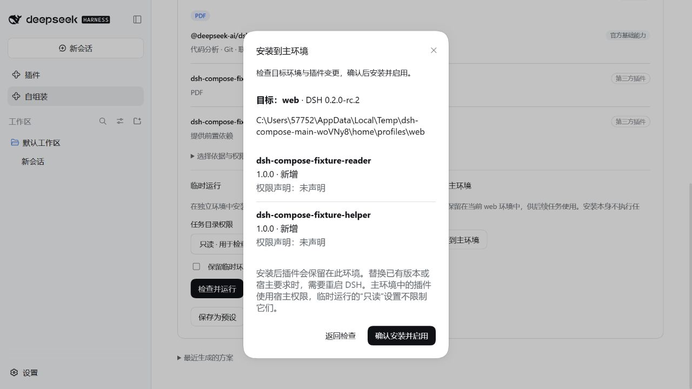

# dsh-autocompose

**描述任务，自动找插件、安装组合，打开可以继续对话的 DSH 窗口。**

AutoCompose 根据中文或英文任务搜索 npm 上的 DSH 插件，核验包的版本与兼容性，再自动安装。在 DSH Desktop 中，它会直接打开一个独立的 DSH 客户端，供你继续对话；也可以把插件安装到当前主环境，供后续任务使用。Web 宿主保留网页窗口方式。搜索关键词、候选数量和排除原因会保存在方案中。

它组装的是已有插件，不生成插件代码。生成方案和安装插件都不调用模型；只有执行任务时才调用模型。

[安装](#安装) · [第一次使用](#第一次使用) · [安装到主环境](#安装到主环境) · [配置与命令行](docs/configuration.md) · [常见问题](#常见问题)

## 安装

当前版本适配 **DSH `0.2.0-rc.2`**，要求 Node.js `>=22.19`。

在 DSH 插件管理页的安装框中输入：

```text
dsh-autocompose@0.5.0
```

也可以粘贴仓库地址：

```text
https://github.com/Han-1413141/dsh-autocompose
```

使用 Desktop 命令行安装：

```powershell
dsh plugin --profile desktop add dsh-autocompose@0.5.0 --save-exact --ignore-scripts
```

Web 用户把 `desktop` 改为 `web`。按 DSH 提示刷新页面或重启后，打开侧边栏的 **“自组装”**。插件复用现有 DSH 运行时，安装时不下载另一套 DSH，也无需允许构建脚本。

## 第一次使用

1. **输入任务和工作目录。** 例如“我要进行数学研究”，目录填写任务文件所在文件夹的完整路径。
2. **选择自动操作。** 点击“自动组装并打开客户端”，会依次搜索插件、检查兼容性、安装到独立环境，并在新窗口提交任务。点击“自动查找并安装到主环境”，会自动安装到当前 profile；这种方式不执行任务。
3. **继续对话或查看安装结果。** 独立窗口使用 DSH 原生聊天界面，第一轮结束后可以继续发消息。主页面保留“重新打开”和“关闭环境”入口。客户端的关闭按钮会隐藏窗口，“重新打开”唤回同一个实例，原会话继续保留。
4. **需要先看方案时，选择“仅生成方案”。** 该操作不安装插件；可查看候选、排除原因与权限声明，再决定如何使用。

自动安装按钮会直接安装匹配的第三方插件，已有其他版本时会替换为方案选定的版本。缺项、已知兼容冲突或构建许可问题会停止后续操作，并显示原因。第三方功能依据发布者的说明识别，不能仅凭搜索结果保证运行效果。

|  | 独立窗口 | 后台执行一次 | 安装到主环境 |
| --- | --- | --- | --- |
| 适合什么情况 | 围绕任务持续对话 | 一次性自动执行 | 长期使用插件 |
| 插件安装在哪里 | 独立 `DSH_HOME` 的 `desktop` profile（Web 宿主为 `web`） | 独立 `DSH_HOME` 的 `sdk` profile | 当前打开 AutoCompose 的 profile |
| 是否执行输入的任务 | 是，完成后可继续对话 | 是，完成后结束 | 否，仅安装并启用 |
| 何时结束 | 点击“关闭环境”或退出主 DSH | 任务完成、取消或超时 | 插件持续保留 |
| 文件与会话 | 默认保留，可取消勾选 | 根据保留选项处理 | 持续保留 |

代码、Git、联网检索和终端由官方基础环境提供。数学、学术研究、LaTeX、数据分析、电子表格、写作、演示文稿、PDF、浏览器、视觉和记忆会按需查找插件。无法识别的任务仍会用原文搜索；没有匹配结果时显示缺项，不把它当成“基础环境已经足够”。

## 安装到主环境

这里的“主环境”指 **当前运行 AutoCompose 的 DSH profile**：在 Desktop 中通常是 `desktop`，在 Web 中通常是 `web`。确认弹窗会显示实际 profile 名称和完整目录。

### 直接安装

希望自动完成搜索和安装时，直接使用任务输入区的 **“自动查找并安装到主环境”**。下面的步骤适用于先查看方案再安装。

1. 生成或打开一个可用方案，点击 **“安装到主环境”**。
2. 检查弹窗中的目标目录、插件名称、版本变化和权限声明。每个插件会标明“新增”“替换版本”“启用”或“已就绪，直接复用”。
3. 点击 **“确认安装并启用”**。如果与主环境中已有插件存在已知冲突，确认按钮会禁用，并显示原因。
4. 查看结果和 **“安装记录”**。DSH 要求重启时，页面会明确提示；重启后再使用这些插件。



图中插件来自临时测试环境，用于演示安装预览。

安装使用 DSH 官方插件管理接口，固定到方案中的精确版本。开始变更前，会保存主环境的包清单、锁文件和相关配置；安装后再次检查包的版本、声明与兼容性，再按依赖顺序启用。已有同版本且已启用的插件直接复用；已有其他版本会明确显示版本替换。官方核心组件、AutoCompose 和 Compat Guardian 不作为方案中的替换目标。

安装期间可以切换页面。“停止安装”会请求取消当前下载，并停止后续操作；已经完成的安装和启用会保留。失败时记录会逐项显示处理状态，便于重试或在 DSH 插件管理中清理。多插件安装不是一次整体事务，配置备份也不是整个插件目录的快照。

主环境中的插件使用宿主权限。临时任务的“只读”设置不限制主环境插件；插件声明的权限用于展示和检查，不是对第三方代码的操作系统级隔离。

### 先试用，再保留

先选择“打开独立客户端”或“后台执行一次”，确认组合适合任务后，回到原方案选择“安装到主环境”。后台执行的方案也可以在 **“运行记录”** 中通过 **“查看方案与安装选项”** 打开。安装前会重新检查当前环境。

这一步按方案重新安装插件包，不复制临时环境中的凭据、会话、模型配置或插件运行数据。需要配置的插件仍在主环境中按其说明配置。

## 独立窗口与临时运行

**“自动组装并打开客户端”** 直接启动本机已安装的官方 DSH Desktop。每个环境有独立的插件目录、会话、客户端数据目录和本机端口，可与主客户端同时运行。它使用完整的 DSH 原生界面，组装过程不会打开浏览器，也不需要再次下载客户端。

新客户端默认只读任务目录，可在启动前改为“允许修改”。初始任务自动提交；在侧边栏“未分组”中打开与任务同名的会话，即可继续发消息。独立环境没有复制主客户端的登录状态；若出现欢迎页，配置 API Key 或选择稍后设置，再进入会话。凭据配置见下文。

关闭客户端右上角的窗口按钮会隐藏窗口；主页面的 **“重新打开”** 会唤回同一个客户端与会话。点击 **“关闭环境”** 才结束该环境的进程，并按保留选项处理文件。在独立客户端菜单中选择退出也会结束该环境。最多同时打开三个环境；退出主 DSH 时停止其独立环境并保留文件。已停止的环境需从原方案重新创建，保留的会话文件仍在记录显示的目录中。

在 Web 宿主中，按钮显示 **“自动组装并打开网页窗口”**；浏览器拦截弹窗时可用页面上的直接链接。若要从 Web 宿主打开本机客户端，在[插件配置](docs/configuration.md#客户端窗口)中设置 `desktopExecutable` 和 `windowMode: desktop`。客户端启动失败会直接显示错误，不会改用浏览器。

需要一次性执行时，选择 **“后台执行一次”**，核对目录和插件后确认。此方式使用 SDK，不弹出聊天窗口。

后台任务在切换页面后继续运行。页面展示准备、安装、检查、执行和清理进度，支持取消；结束后保存回复，并根据保留选项处理临时目录。

默认模型为 `deepseek-official / deepseek-v4-flash`。子进程保留必要的系统与代理环境变量，默认额外转发 `DEEPSEEK_API_KEY`。Desktop 的登录状态不会自动复制为临时环境凭据。使用其他模型或 provider 时，先阅读[模型与凭据配置](docs/configuration.md#模型与凭据)。规划和主环境安装无需模型凭据。

## 预设与对话操作

**保存为预设**会保存任务目录和插件的精确版本。复用预设时会重新检查兼容性，不自动安装，也不自动追踪 `latest`。

你也可以在 DSH 对话中提出：

> 调用 autocompose 的 assemble，为数学研究自动查找兼容插件并安装到当前环境。

或者：

> 调用 autocompose 的 assemble，destination 设为 window，为数学研究组装一个可持续对话的独立环境，直接打开 DSH 客户端。

`assemble` 将搜索、规划和安装接成一次工具操作，实际安装仍遵守 DSH 的批准流程。需要分步审阅时使用 `plan` → `install_preview` → `install`；后台执行使用 `run`。工具参数与 CLI 用法见[配置与命令行](docs/configuration.md)。

## 常见问题

### 为什么没有找到所需插件？

查看方案中的“搜索记录”与“选择依据”。自动发现查询 npm 的 `dsh-plugin` 和 `deepseek-harness` 两类标签，并逐个核验精确版本。只有 GitHub 仓库、未发布到 npm 的项目暂不支持自动安装。包缺少 bundle 声明、说明不匹配或版本不兼容时会排除；网络错误也会显示。可补充具体任务或英文关键词，或在固定候选目录中指定包名、版本和能力。

### 为什么旧版运行后没有窗口，也没有找到数学插件？

0.3.0 的临时运行只有后台 SDK 模式，且任务识别不包含数学研究。升级到 0.5.0 后重新生成方案，再使用“自动组装并打开客户端”。旧方案不会自动补入新插件。

### 为什么 0.4.0 打开的是浏览器？

0.4.0 使用网页弹窗，DSH Desktop 会把弹窗交给系统浏览器。0.5.0 改为启动官方客户端实例；升级插件并按 DSH 提示重启后，主按钮应显示“自动组装并打开客户端”。旧的网页环境需关闭后重新创建。

### 临时运行成功后，为什么主环境里没有这些插件？

临时运行使用独立环境，插件没有安装到主 profile。需要主环境也能使用时，打开该方案，选择“安装到主环境”。

### 为什么提示安装预览失效？

预览生成后，插件列表或配置发生了变化，或者 DSH 已重启、该预览已使用。重新点击“安装到主环境”即可获取新的检查结果。插件发布内容变化时，需要重新生成整个方案。

### 安装只完成了一部分，怎么办？

打开“安装记录”查看每个插件的状态和错误。处理冲突、网络或构建授权问题后重新预览：已安装并启用的同版本插件会复用；不需要保留的插件可在 DSH 插件管理中停用或卸载。AutoCompose 不自动删除已经成功安装的插件。

### 安装 AutoCompose 时出现 Git 构建被拦截或 NPM_TOKEN 提示？

`ERR_PNPM_GIT_DEP_PREPARE_NOT_ALLOWED` 通常来自固定到 0.2.0 的旧 Git 提交。改用本页的 npm 包名或当前仓库地址；从 0.2.1 起仓库包含编译产物，安装不需要构建许可。`Failed to replace env in config: ${NPM_TOKEN}` 是 npm 配置变量提示；安装公开的 AutoCompose 包不需要 npm Token。

## 开发与验证

本仓库可独立构建，无需检出配套插件：

```powershell
npm ci --ignore-scripts
npm run typecheck
npm test
npm run build
npm run test:host
npm run test:main-install
npm run test:window
# 本机已安装 DSH Desktop 时，再运行客户端集成检查：
$env:AUTOCOMPOSE_DESKTOP_EXE = "C:/实际安装目录/DeepSeek Harness.exe"
npm run test:desktop
npm run preview
```

发布前运行 `npm run pack:release`。源码修改需同时提交重新生成的 `lib/`；CI 核对产物与源码，并在禁止构建脚本的全新 profile 中验证 Git 安装。主环境安装测试使用临时 profile 和无业务逻辑的测试插件，不修改日常 DSH 环境。

[配置与命令行](docs/configuration.md) · [故障覆盖表](docs/failure-matrix.md) · [验证记录](docs/validation.md) · [版本记录](CHANGELOG.md) · [问题反馈](https://github.com/Han-1413141/dsh-autocompose/issues)

配套插件：[dsh-compat-guardian](https://github.com/Han-1413141/dsh-compat-guardian)，用于检查和处理已安装插件的兼容性问题。两者可分别安装。
