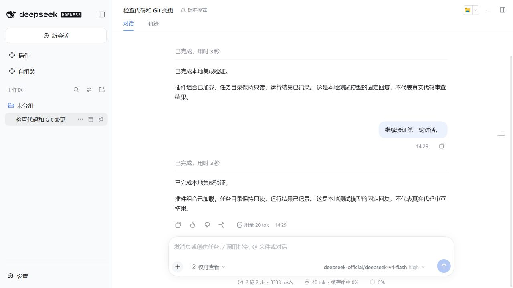

# 验证记录

## 0.5.0 独立桌面客户端

2026-10-01，Windows / Node.js 24.19.0 / 官方 DSH Desktop 0.2.0-rc.2：

- TypeScript、构建和 47 项测试通过。新增客户端选择、缺失安装、路径与环境变量隔离检查。
- `test:desktop` 实际启动本机官方客户端，与日常主客户端同时运行。验证独立 `desktop` profile、初始任务进入本地模型、后台持续运行及重新唤回同一进程。
- 通过客户端自带 CLI 安装无业务逻辑的本地测试插件，确认其在独立客户端中实际加载。
- 同时启动两个独立客户端，验证进程和目录不同；关闭其中一个后，另一个仍然运行。独立 profile 使用动态端口，修复默认端口 19387 被主客户端占用的问题。
- 验证跨会话操作拒绝、取消启动、停止进程和删除自有临时目录。所有测试使用本地固定回复模型，没有调用付费模型。
- 原有 Web 窗口集成检查通过，保留 Web 宿主的初始对话、继续运行和清理行为。

本次验证确认官方客户端进程与 Host 的实际行为，没有进行原生窗口的截图或视觉验收。macOS 客户端尚未实测；下方 0.4.0 的截图仍是 Web 界面。

实现依据是官方 [DSH Desktop 窗口与单实例逻辑](https://github.com/deepseek-ai/deepseek-harness/blob/master/apps/desktop/src/main.ts) 及 Electron 的[客户端数据目录启动参数](https://github.com/electron/electron/blob/main/shell/app/electron_main_delegate.cc)。不修改客户端安装文件。

## 0.4.0 自动组装与独立窗口

2026-10-01，Windows / Node.js 24.19.0 / DSH 0.2.0-rc.2：

- 45 项测试通过，覆盖自然语言“我要进行数学研究”、陌生任务、双标签搜索、占位包与插件市场过滤、旧版本排除、断网及取消。
- 对公开 npm 执行真实规划，识别 `math`、`research`，选中 `dsh-vibe-math@2.6.0`、`dsh-academy@0.1.0`。这是元数据与兼容声明验证，未执行这些第三方插件的业务功能。
- 真实 DSH 的自动组装 API 从搜索结果发现本地无业务逻辑的数学插件，经官方 Plugin Manager 安装后确认实例为 `active`。安装复用、版本替换、工具冲突和安装后条目冲突测试继续通过。
- 独立窗口使用真实 Web profile。验证了实际 HTML、初始会话、本地模型调用、第一轮结束后保持运行、跨会话拒绝、访问令牌不落入记录、关闭进程、目录清理及取消启动。
- 浏览器中打开独立界面，完成两轮对话；第二轮返回后会话仍可继续输入。模型为本地固定回复，不调用付费模型。浏览器弹窗策略因宿主而异，页面保留直接打开链接。
- SDK 的后台执行、取消与清理测试继续通过。

图中回复来自本地模型替身，用于验证对话流程。

## 0.3.0 主环境安装与文档更新

2026-09-30，Windows、DSH `0.2.0-rc.2`：

- TypeScript 检查和 41 项测试通过，其中 11 项新增测试覆盖主环境安装、同版本复用、启用、版本替换、配置变化、会话归属、制品变化、依赖顺序、取消、部分失败和安装后检查；另一项新增测试在 Windows 中实际持有文件句柄，验证原子写入可以等待读取者释放后完成。
- `npm run test:main-install` 在新建的 Web profile 中通过真实页面 API 生成方案、预览并安装；官方 Plugin Manager 实际安装两个无业务逻辑的测试包，加载状态均为 `active`。
- 真实管理器验证同版本复用、停用后重新启用、版本替换和重启提示。声明中的同名工具在安装前被拦截；只能读取包文件才能发现的重复条目在安装后被拦截，测试包保持未启用。
- 集成测试只替换测试包的 npm 元数据和下载来源，将精确包名映射为临时目录中的本地包；安装、配置持久化、热加载和状态查询均使用真实 DSH。公共 npm 请求参数由单元测试检查。
- 原有 `test:host` 通过：真实 DSH 工具调用、官方 SDK 的临时执行、取消和清理正常，模型使用本地 HTTP 替身。
- 在真实 Web 页面完成“生成方案 → 安装确认 → 安装记录”，查看逐项已启用结果；同名工具冲突显示原因并禁用确认按钮。1280 × 720 页面无横向溢出。截图为[安装预览](images/main-install-preview.jpg)和[安装结果](images/main-install-result.jpg)。
- 使用说明完成一轮独立只读评审，修正工作目录参数的适用范围、自定义 provider 入口、环境变量转发范围和候选数量说明。

以上测试使用临时 profile，未在日常环境中安装测试包。静态兼容检查覆盖插件声明和包文件，不能提前证明所有第三方运行时代码都无冲突。以下旧版本记录保留原验证范围。

发布提交 `6e2cb5ca789250adfdfa8998d1b5fa566caa251b` 的 [Windows/Linux CI](https://github.com/Han-1413141/dsh-autocompose/actions/runs/36730889918) 全部通过：Windows 41 项测试通过；Linux 40 项通过，跳过仅适用于 Windows 的文件句柄测试。两平台均完成产物一致性、无构建授权的 Git 安装、真实宿主与主环境安装检查。

日期：2026-09-30。插件版本：0.2.0。环境：Windows、Node.js 24.19.0、npm 11.17.0。真实宿主与 SDK：DSH `0.2.0-rc.2`。

以下为拆分前两个插件的联合验证记录（共 50 项）。本仓库保留对应测试及共享逻辑测试，拆分后的检查由独立 CI 运行。

## 自动检查

| 检查 | 结果与范围 |
| --- | --- |
| TypeScript | `npm run typecheck` 通过 |
| 核心与失败路径 | `npm test`，50 项通过，包含真实文件、锁与子进程操作；npm 网络异常和部分管理状态使用替身 |
| 构建 | 两个包生成 Host、CLI、core、Typert 与 Web client 入口 |
| 真实工具管线 | `test:host`：DSH 加载两个插件，本地模型通过真实工具管线调用 plan/check |
| 真实 SDK | `test:host`：独立环境执行、运行中取消、关闭子进程及清理临时目录 |
| 真实插件冲突 | `test:conflicts`：五个故障与对照包，经官方 CLI 安装；服务冲突、旧接口、加载抛错和依赖等待均实际发生 |
| 真实处理与恢复 | 实际 Plugin Manager 隔离故障包，保留正常服务提供者，拒绝冲突恢复，故障修复后恢复主插件与依赖插件 |
| 真实卸载 | 隔离旧接口包后实际调用 `removeBundle`，确认其已不在已安装 bundle 列表中 |
| 启动故障 | `test:startup`：缺失导出与配置错误在此版本降级启动；`process.exit(73)` 导致退出；永不返回的 async apply 导致启动超时 |
| 离线救援 | 四种启动故障分别备份并停用目标包，随后启动均恢复正常 |
| 本地损坏安装 | 缺失/损坏 manifest、patch、前端产物，越界路径、错误包身份和失效 link 均通过真实临时文件测试 |
| 状态变化 | 检查后插件已变更、外部重新启用、外部升级、旧失败次数、重启遗留任务、其他进程运行中均有断言 |

真实冲突报告写入 `.test-output/conflict-report.json`，启动报告写入 `.test-output/startup-fault-report.json`；访问令牌从报告日志中移除。它们是本次本地证据，不随 npm 包发布。

## Web 交互

在真实 DSH Web 中验证：两个侧边栏入口、任务示例与规划、预设保存、运行确认、跨页面后台执行、历史结果及清理状态、冲突隔离确认、拒绝带冲突恢复、升级预检。界面取消任务后显示“已取消 / 临时环境已清理”。使用原生主题与组件，页面错误保留到下一次明确操作。

在 1200 × 900 和 480 × 900 窗口检查布局，两种宽度均未发生横向溢出；窄窗口的表单改为单列。实际切换原生浅色与深色主题，检查文字、卡片、按钮及状态标签。浏览器尺寸覆盖在检查后恢复。

界面截图保存于 `docs/images/`，其中插件名与运行内容来自临时测试环境。该环境的模型回复由本地替身生成。

- [兼容守护：浅色主题](images/guardian-light.jpg)
- [自组装：深色主题](images/autocompose-dark.jpg)
- [自组装：窄窗口](images/autocompose-narrow.jpg)

两个 Web client 构建产物均约 99 KiB，低于 256 KiB；组件通过官方运行时共享。

## 本轮测试促成的修正

1. 两个插件并行争用服务时，改为优先保留实际已运行的一方，避免按声明优先级先后停用双方。
2. 升级预检将官方基础组件按随 DSH 升级处理，避免其精确版本依赖产生基础组件误报。
3. 修正 Typert RemoteResult 解包、远程服务注入作用域和严格编解码工厂；增加界面渲染错误边界。
4. 恢复失败提示不再被自动刷新清掉；旧检查结果不能操作已变化的插件。
5. 复用预设重新计算能力；其他进程的活动任务不再误报中断；外部升级会结束旧隔离记录。

## 验证边界

- 集成模型使用本地 HTTP 替身，验证执行流程，不评价真实模型任务质量。未消耗付费模型额度。
- 历史在线发现曾实际读取 npm 候选；本轮网络错误用受控替身注入。未执行第三方 PDF 插件的实际内容处理，也不把包说明当成功能验证。
- 真实卸载在临时 Web profile 中完成；Desktop、Linux、macOS 与未来 DSH 版本未运行验证。以下为拆分前记录；发布时的独立 CI 结果见文末。
- 前端缺失文件、RPC 描述及本插件界面有检查；第三方旧图标、浏览器业务错误、会话格式迁移、原生模块崩溃不能通用自动修复。对应范围见[故障覆盖表](failure-matrix.md)。
- 当前版本以两个独立仓库和 npm 包发布。用户现有 DSH profile、凭据与其他项目未修改。

集成脚本使用各自新建的临时目录并在结束时清理。预览关闭时清理自身临时环境。

## 独立仓库

本仓库为 dsh-autocompose。另一插件及对应测试见 [dsh-compat-guardian](https://github.com/Han-1413141/dsh-compat-guardian)；两个仓库的共享检查测试有重叠，不将测试总数简单相加作为新增覆盖。

## 0.2.0 发布验证

独立仓库的 28 项测试通过；[Windows/Linux CI](https://github.com/Han-1413141/dsh-autocompose/actions/runs/36690680511) 均通过，验证提交为 `c232ca92ece591a743238d057cb3dd4bc4d5251f`。

最终 npm 安装包已通过官方 CLI 安装并在真实 DSH Web 中加载，线上完整性值与本地测试文件一致。GitHub Release 附件与 npm 使用同一安装包。

## 0.2.1 安装修复验证

2026-09-30：旧提交 `7f260e4` 在未授权构建脚本的临时 profile 中复现 `ERR_PNPM_GIT_DEP_PREPARE_NOT_ALLOWED`。

- 提交 `10600c00e438069fdd64b93ae5f6081d23ec0d83` 已包含编译文件，移除安装生命周期脚本；SDK 客户端随插件编译，运行时从当前 DSH 安装解析。
- pnpm 11.21.0、全新独立 store、空 `allowBuilds`，不传 `--ignore-scripts`：直接从公开 GitHub 地址安装通过，入口文件与本地编译结果一致，CLI 帮助正常，profile 未额外安装整套 DSH。
- 29 项测试、真实 SDK 的执行、取消和清理通过；最终 npm 安装包在真实 DSH Web 中加载为 `active`。模型仍使用本地 HTTP 替身。
- [本次 Windows/Linux CI](https://github.com/Han-1413141/dsh-autocompose/actions/runs/36693866471) 全部通过，包括编译产物一致性与 Git 安装回归检查。
